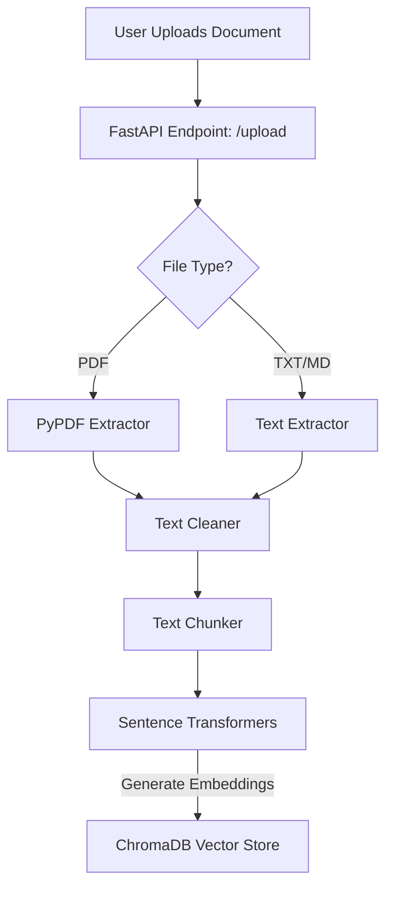
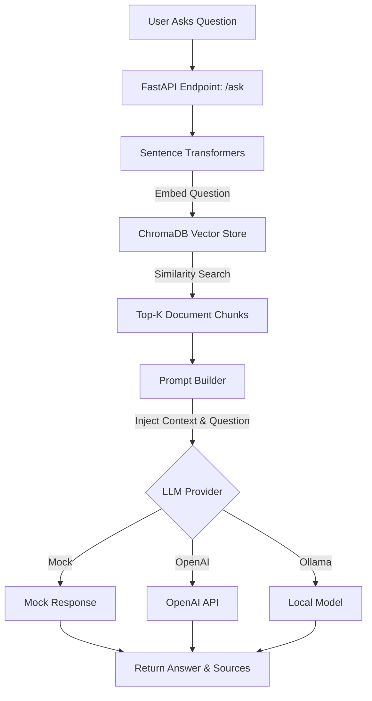

# Application Architecture

## Document Ingestion Flow

## Retrieval and Generation (RAG) Flow

## Key Components

1. **Document Processing**: Cleans and chunks the text into overlapping segments to preserve context across boundaries.
2. **Retrieval**: Uses dense vector embeddings (Cosine Similarity) to find the top `K` most relevant chunks for a given query.
3. **Generation**: Uses a strict prompt template that forces the LLM to only use the provided context, triggering a guardrail fallback if the answer is not present.
